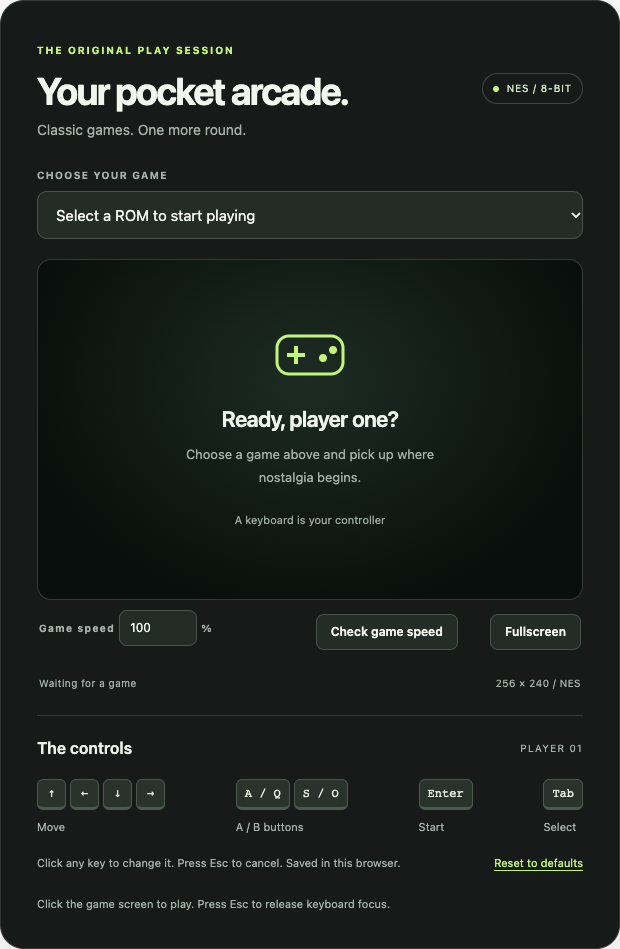
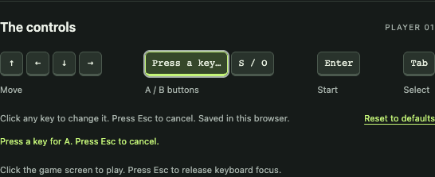

# Retro Game Emulator Forked

Turn a WordPress post or page into a browser-based NES arcade. This fork of [Retro Game Emulator](https://wordpress.org/plugins/retro-game-emulator/) uses the bundled JSNES 2.1 emulator and adds a block editor integration, ROM uploads, customizable keyboard controls, fullscreen play, and game-speed tools.

No ROMs are included. Add your own uncompressed `.nes` files to populate the game selector.

## Features

### Playing games

- **NES emulation with audio:** play in a browser with a pixelated 256 × 240 game display. Audio renders off the main thread through an AudioWorklet, falling back to the older ScriptProcessor API on pages that are not served over HTTPS or whose security policy blocks `blob:` scripts.
- **Shared game library:** visitors choose from the ROMs installed on your site without needing a WordPress account.
- **Arcade interface:** dark styling, a game selector, control guide, and waiting, loading, now-playing, and error messages. The layout adapts to available space.
- **Fullscreen:** expand the player and its speed toolbar in supported browsers while preserving the game's aspect ratio.
- **Adjustable speed:** choose a whole-number percentage from **25% to 200%**. The browser remembers your choice when local storage is available; audio follows the selected speed.
- **Consistent timing:** 100% targets 60 emulated frames per second independently of display refresh rate. Emulation and audio stop while the tab is hidden, and timing resets when you return.
- **Speed diagnostic:** a 10-second check reports actual game FPS, target FPS, the longest display gap, and pauses over 50 ms, with guidance for interpreting slowdowns or uneven playback.

### Keyboard controls

- **Remappable player-one controls:** click a displayed key and press its replacement. Conflicting assignments are rejected, and Escape cancels a change.
- **Remembered preferences:** assignments persist in this browser when local storage is available. **Reset to defaults** restores the original bindings.
- **Focus-aware input:** game controls apply while the game screen has keyboard focus. Escape releases that focus, and held buttons are released when focus is lost.
- **Accessibility features:** labeled controls, visible focus indicators, and live status feedback for loading, remapping, fullscreen errors, and speed checks.

### WordPress integration and ROM management

- **NES Emulator block:** a server-rendered editor preview, a **Manage roms** settings link, and wide/full alignment where supported by the theme.
- **`[nes]` shortcode:** embed the same player in a post or page, including through a Shortcode block.
- **Multiple-file uploads:** select or drag `.nes` files into the WordPress media uploader from the settings page or the frontend **Upload ROMs** button.
- **Restricted upload access:** uploading requires both `manage_options` and `upload_files` capabilities. The frontend upload button is shown only to users with both.
- **Upload validation:** checks the `.nes` extension and a 16-byte header beginning with the NES signature. This identifies a ROM container; it does not guarantee every game is supported by the emulator.
- **Installed-ROM management:** view filenames and storage location, and delete ROMs from settings with confirmation. Deletion uses WordPress permissions and nonces and restricts file paths to the ROM folder.

## Screenshots

Captured from this fork running on a local WordPress site. These show the visitor interface; administrators with upload permission also see **Upload ROMs** beside the selector.

### Player and game-speed tools



### Changing a keyboard binding



## Installation

1. Place this repository's plugin folder in `wp-content/plugins/`, or upload a ZIP containing the folder through **Plugins → Add New → Upload Plugin**.
2. Activate **Retro Game Emulator** in the WordPress Plugins screen.
3. Open **Settings → Retro Game Emulator**, click **Upload ROMs**, and select or drag in one or more uncompressed `.nes` files.
4. Wait for the uploads to finish, then close the uploader. The page refreshes to show the installed games.
5. Add the **NES Emulator** block to a post or page, or insert the shortcode below.
6. Publish the page, choose a game, and start playing.

```text
[nes]
```

Use a current browser with JavaScript, Canvas, Web Audio, and a keyboard. Fullscreen availability depends on the browser and embedding permissions. Browser storage is optional: if unavailable, controls and speed still work for the current visit.

The block uses WordPress block metadata and Block API version 2; use WordPress 5.6 or newer for that integration. The legacy compatibility labels in `readme.txt` are not a tested compatibility matrix for this fork.

## Playing and customizing controls

Selecting a ROM starts it and focuses the game screen. Click the screen again after using other controls to resume keyboard input.

| NES action | Default keyboard keys |
| --- | --- |
| Move | Arrow keys |
| A button | A or Q |
| B button | S or O |
| Start | Enter |
| Select | Tab |
| Release game focus / cancel remapping | Escape |

To remap an action, click its key in **The controls** and press a new key. A custom assignment replaces that action's default keys. Preferences are local to this browser and site; they do not sync to a WordPress account. **Reset to defaults** resets keyboard bindings, not game speed.

Use **Fullscreen** to enlarge the player and **Exit fullscreen** to return; browsers also normally support Escape to leave fullscreen.

### Checking game speed

Start a game, click **Check game speed**, and keep the tab visible for 10 seconds. You can keep playing during the check.

- **Game FPS / target:** compares emulated frames per second with the selected speed. At 100%, the target is 60; at 50%, it is 30.
- **Longest display gap and pauses:** help identify stuttering even when average speed reaches its target.
- **Interpretation:** the result distinguishes steady play, falling behind, running above target, and pauses. The check does not change your speed setting.

Changing games, changing speed, or hiding the tab cancels an active check. If the browser is falling behind, close busy tabs or applications and retest; raising the speed percentage does not fix a performance bottleneck.

## Managing ROMs

ROMs live in the `retro-game-emulator/` subfolder of WordPress's uploads directory, normally:

```text
wp-content/uploads/retro-game-emulator/
```

The settings page shows the actual path for your site. The frontend and block use the same library. Files uploaded through the plugin are also WordPress media attachments. Manually placed `.nes` files in this folder are listed too, but bypass upload-time header validation.

Use **Settings → Retro Game Emulator → Installed Roms → Delete** to remove a game. Uploads follow the site's normal upload-size limits; ZIP archives are not supported. ROMs are served from public uploads URLs, so only upload files you have permission to share.

## Standalone page (no WordPress)

`standalone/index.html` runs the same player without WordPress, using the shared `lib/` files. Open it from any static host (or `python3 -m http.server` in the repository root, then visit `/standalone/`); double-clicking the file also works in current browsers.

- **Open ROMs** or drag `.nes` files onto the page. The first file starts playing immediately; files without an NES header are rejected.
- Opened games are stored in this browser's IndexedDB and appear in the game selector on later visits. **Remove** deletes the selected game from the browser. Nothing is uploaded anywhere.
- If the browser cannot store games (for example, some private windows), they stay available until the page is closed.
- If a dropped game starts silently, click the game screen to start audio.

## Current limitations and troubleshooting

- **One emulator per page:** the block prevents multiple instances; use only one `[nes]` shortcode per page as well.
- **Keyboard-only, player one:** touch controls, gamepads, and a second controller are not implemented.
- **No saved game progress:** saved controls and speed preferences are not save states or cartridge battery saves. Reloading the page or selecting a game starts a fresh session.
- **No dedicated pause, restart, mute, or volume controls:** hiding the tab suspends emulation; leaving keyboard focus alone does not pause the game.
- **ROM does not load:** use an uncompressed `.nes` file and check that its uploads URL is accessible. A valid header does not imply JSNES mapper compatibility; if a game needs an unsupported cartridge mapper, the status line names it. Network failures, load errors, and games that crash during play also appear in the status line.
- **No upload button:** sign in with an account that has both required capabilities. Visitors can play but cannot upload.
- **No audio:** select the game again to retry audio initialization and check the browser's audio permissions and system volume.
- **No fullscreen button:** the browser or embedding context may not expose the required Fullscreen API.

## Roadmap ideas

These are brainstormed possibilities, not implemented features or release commitments.

| Area | Potential addition | Why it would help |
| --- | --- | --- |
| Playback | Pause/resume, restart, mute, and volume controls | Give players direct control over each session. |
| Saved progress | Local save states, cartridge battery saves, and save import/export | Let players continue longer games later. |
| Controllers | Gamepad support with remapping and connection status | Make USB and Bluetooth controllers usable. |
| Mobile play | Touch D-pad and buttons, plus small-screen layout testing | Make the arcade playable without a physical keyboard. |
| Multiplayer | Local player-two controls for keyboard and gamepad | Support two-player NES games. |
| Game library | Friendly titles, cover art, search, categories, and favorites | Make larger ROM collections easier to browse. |
| Embedding | Per-block default game, curated game lists, and optional selector hiding | Let each page feature a particular game or collection. |
| Multiple players | Independent emulator instances with scoped input and audio | Safely support more than one embed per page. |
| Presentation | Theme colors, compact layout, and configurable control hints | Fit the player into more WordPress designs. |
| Compatibility | A tested ROM/browser matrix | Make failures easier to understand and reproduce. |
| Accessibility | Broader keyboard and screen-reader testing, translated UI strings | Improve access to setup, controls, and feedback. |
| Maintenance | Load assets only where needed and expand integration tests | Reduce page overhead and catch regressions. |

## Development

The PHP and JavaScript sources run directly; there is no build step. Main files:

- `retro-game-emulator.php`: registration, rendering, uploads, and ROM management.
- `shortcode-template.php` and `lib/frontend.css`: player markup and styling.
- `lib/app.js`: emulation loop, audio, keyboard controls, fullscreen, and speed tools.
- `lib/admin.js` and `options.php`: media uploader and settings interface.
- `blocks/nes/`: block metadata and editor integration.
- `standalone/`: the WordPress-free page and its IndexedDB ROM library (`standalone.js`), which plays files through `lib/app.js`'s `rge:load-file` event.

`standalone/index.html` is generated; don't edit it directly. `tools/build-standalone.cjs` builds it from the player markup in `shortcode-template.php` plus the page shell in `standalone/page-template.html`, and stamps the `lib/` and `standalone.js` URLs with content hashes so browsers pick up new versions. A pre-commit hook regenerates and stages it on every commit. Enable the hook once per clone:

```sh
git config core.hooksPath .githooks
```

To rebuild or check by hand:

```sh
node tools/build-standalone.cjs          # regenerate standalone/index.html
node tools/build-standalone.cjs --check  # exit 1 if it is out of date
```

If the build stops with "could not find…" or "unsupported PHP", the template changed in a way the generator doesn't translate yet; update the matching rule in `tools/build-standalone.cjs`.

Run the existing speed-analysis regression checks with Node.js:

```sh
node tests/speed-analysis.cjs
```

These cover simulated refresh-rate/speed combinations, slowdowns, uneven playback, cancellation, and retry behavior; they are not a full browser or WordPress integration suite.

## Credits and license

Based on **Retro Game Emulator** by grimmdude, powered by **JSNES** 2.1.0 (Apache-2.0) by bfirsh and contributors. The plugin declares **GPLv2 or later**; see the bundled [LICENSE](LICENSE) for license text.
